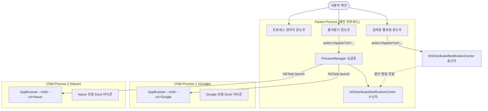

# AppBrowser 시스템 아키텍처 및 설계 상세

본 문서는 **AppBrowser**의 내부 동작 원리, 멀티프로세스 아키텍처, 윈도우 관리 방식, IPC 프로토콜, 그리고 파비콘 및 생명주기 관리 메커니즘을 상세히 설명합니다.

---

## 1. 멀티프로세스 아키텍처 (Multi-Process Architecture)

AppBrowser는 웹 브라우징 작업을 단일 렌더러 프로세스들의 집합이 아닌 **독립된 운영체제 레벨 프로세스**들의 집합으로 격리합니다.



### 1) 부모 프로세스 (Parent Process Mode)
- **실행 모드**: 인자 없이 실행되거나 앱 번들이 단독으로 실행될 때 기동됩니다.
- **주요 역할**:
  - `ProcessManager` 대시보드 창, `Search` 검색창, `Bookmarks` 즐겨찾기 창을 호스팅합니다.
  - 모든 하위 자식 브라우저 프로세스를 생성(`NSTask`)하고, PID 목록 및 라이브니스(Liveness)를 1초 주기로 폴링하여 관리합니다.
  - 분산 알림(`NSDistributedNotificationCenter`) 리스너를 열어 독립 자식 프로세스로 분리된 검색창으로부터 실행 요청을 수신합니다.

### 2) 자식 브라우저 프로세스 (Child Browser Process Mode)
- **실행 모드**: `--child --url=<target_url>` 인자와 함께 기동됩니다.
- **주요 역할**:
  - 독립된 `CefWindow` 및 전체 화면 웹 브라우징 화면(1280x800)을 제공합니다.
  - `~/Library/Application Support/AppBrowser/Child_<DomainHash>` 경로에 완전 분리된 쿠키, 세션, 캐시 저장소를 가집니다. (경로를 제외한 도메인 주소를 자연수 해시값으로 변환하여 동일 도메인의 세션과 캐시를 영속적으로 공유 및 격리 관리)
  - 해당 사이트의 파비콘을 즉시 다운로드하여 자신의 macOS Dock 아이콘(`[NSApp setApplicationIconImage:]`)을 사이트 전용 아이콘으로 변경합니다.

---

## 2. 윈도우 관리 및 CEF Views 프레임워크

AppBrowser는 CEF의 고수준 네이티브 UI 레이어인 **CEF Views Framework**(`CefWindow`, `CefBrowserView`, `CefWindowDelegate`)를 기반으로 구축되었습니다.

### 1) 프레임리스 투명 윈도우 (Frameless Translucent Window)
- **적용 대상**: 검색창(`is_search_`), 즐겨찾기창(`is_bookmarks_`)
- **기술 구현**:
  - `CefWindowDelegate::IsFrameless()`에서 `true`를 반환하여 OS 기본 타이틀바와 프레임을 제거합니다.
  - `CefWindow::SetBackgroundColor(CefColorSetARGB(0, 0, 0, 0))` 및 `CefBrowserView::SetBackgroundColor`를 통해 렌더러 배경을 100% 투명화합니다.
  - Cocoa 레벨(`SetWindowTranslucent`)에서 `[window setOpaque:NO]`와 `[window setBackgroundColor:[NSColor clearColor]]`, `[view.layer setOpaque:NO]`를 호출하여 웹 뷰 뒤의 macOS 데스크톱 배경이 블러와 함께 완벽히 투과되도록 만듭니다.
  - 웹 CSS의 `-webkit-app-region: drag` 영역을 통해 마우스로 자유롭게 드래그하여 이동할 수 있습니다.

### 2) 화면 하단 전용 배치 로직 (`PositionWindowAtBottom`)
- **적용 대상**: 즐겨찾기창(`is_bookmarks_`)
- **기술 구현**:
  - CEF의 기본 `CenterWindow` 대신, Cocoa AppKit의 화면 가용 작업 영역(`[screen visibleFrame]`, Dock 및 상단 메뉴바 제외 영역)을 실시간 측정합니다.
  - 가로 중앙: `visibleFrame.origin.x + (visibleFrame.size.width - width) / 2.0`
  - 세로 하단: `visibleFrame.origin.y + 36px` (Dock 바로 위 최적 여백)
  - 이를 통해 검색창(화면 중앙 상단)과 즐겨찾기창(화면 하단)이 결코 겹치지 않고 조화롭게 열립니다.

---

## 3. 프로세스 간 통신 (IPC Architecture)

AppBrowser는 두 가지 수준의 IPC를 통합 운영합니다:

### 1) 내부 액션 프로토콜 (`action://` URL Scheme)
HTML/JS 프론트엔드에서 C++ 백엔드로 명령을 전달하기 위해 가상 URL 내비게이션 인터셉트 방식을 사용합니다.
- `CefRequestHandler::OnBeforeBrowse`에서 URL이 `action://`으로 시작하는지 감지하고 즉시 취소(`return true`)한 뒤 명령을 디코딩합니다.

| Action URL | 파라미터 | 동작 내용 |
| :--- | :--- | :--- |
| `action://spawn` | `url=<URL>` | 대상 URL을 로드하는 새 자식 브라우저 프로세스 실행 |
| `action://kill` | `pid=<PID>` | 지정된 PID를 가진 자식 브라우저 프로세스 강제 종료 |
| `action://focus` | `pid=<PID>` | 지정된 PID를 가진 자식 브라우저 창을 최상단으로 활성화 |
| `action://kill-all` | - | 실행 중인 모든 자식 브라우저 프로세스를 일괄 종료 |
| `action://open-search` | - | 숨겨져 있거나 닫힌 검색창을 화면에 표시/재생성 |
| `action://open-bookmarks`| - | 즐겨찾기 창을 화면 하단에 표시하고 최상단 활성화 |
| `action://close-bookmarks`| - | 즐겨찾기 창을 화면에서 숨김(`Hide`) 처리 |
| `action://update-meta` | `pid=<PID>&name=<NAME>&groupId=<GID>` | 프로세스 이름 및 그룹 변경을 C++ 백엔드 및 세션 파일에 동기화 |
| `action://set-group-visibility` | `groupId=<GID>&visible=<1/0>` | 해당 폴더(그룹) 내 모든 자식 프로세스의 창을 일괄 숨김/보임 처리 |
| `action://set-child-visibility` | `pid=<PID>&visible=<1/0>` | 개별 자식 프로세스의 창을 숨김/보임 처리 |
| `action://ready` | - | 프로세스 관리자 UI 로딩 완료 통지 및 초기 프로세스 목록 전송 |

### 2) 분산 알림 센터 (`NSDistributedNotificationCenter`)
- **검색창 스폰 통신 (`AppBrowser_Spawn_<parentPid>`)**:
  - 독립 자식 프로세스로 분리된 검색창이 부모 프로세스로 URL 실행을 요청할 때 사용합니다.
- **실시간 주소 동기화 (`AppBrowser_UrlChange_<parentPid>`)**:
  - 자식 브라우저에서 페이지 탐색이 일어날 때 전체 URL(경로, 쿼리 포함)과 타이틀을 부모 프로세스에 실시간 동기화합니다.
- **창 가시성 제어 (`AppBrowser_Visibility_<childPid>`)**:
  - 프로세스 관리자에서 폴더를 닫거나 열 때, 부모 프로세스가 `NSRunningApplication hide/unhide`와 더불어 해당 자식 프로세스에 가시성 변경 알림을 전송합니다.
  - 자식 프로세스는 이를 수신하여 `CefWindow::Hide()/Show()` 및 `NSApp hide/unhide`를 즉각 동기화합니다.

---

## 4. 세션 영구 보존 및 실시간 URL 동기화 (Session Persistence & Real-Time Sync)

AppBrowser는 앱을 종료하더라도 작업 중이던 웹 앱 환경이 그대로 보존되도록 자동 세션 관리 메커니즘을 지원합니다.

1. **실시간 도메인 및 경로/파라미터 변경 감지 (`AppBrowser_UrlChange_<parent_pid>`)**:
   - 자식 브라우저(`--child`)에서 사용자가 링크를 클릭하거나 페이지 내 탐색(리다이렉트, 검색, 하위 페이지 이동 등)을 수행할 때 `CefDisplayHandler::OnAddressChange` 및 `OnTitleChange`가 발생합니다.
   - 자식 프로세스는 `config_.parent_pid`를 통해 부모 프로세스의 분산 알림 채널(`AppBrowser_UrlChange_<parentPid>`)로 자신의 `pid`, 변경된 전체 `url`(도메인, 하위 경로, 쿼리 파라미터 전부 포함), 최신 `title`을 실시간 전송합니다.
   - 부모의 `ProcessManager::UpdateProcessUrl`은 자식 프로세스 목록의 `url`과 `title`을 즉시 갱신하고, 관리자 UI(`NotifyManagerUI`)에 반영하며, `SaveSession()`을 트리거합니다.
   - 자식 프로세스의 Dock 아이콘 역시 `SetAppDockIconForUrl`을 통해 변경된 도메인의 파비콘으로 즉시 교체됩니다.

2. **실시간 세션 동기화 (`SaveSession`)**:
   - 자식 브라우저 프로세스가 기동(`SpawnChild`), 종료(`TerminateChild`), 감시 변경(`RefreshProcesses`), 메타데이터 수정(`UpdateProcessMeta`), 페이지 주소 변경(`UpdateProcessUrl`), 또는 폴더 접기/열기로 인한 가시성 변경(`SetChildVisibility`, `SetGroupVisibility`)될 때마다 `~/Library/Application Support/AppBrowser/session_apps.json`에 현재 열려 있는 모든 웹 앱 정보(`url`, `name`, `groupId`, `visible`)가 실시간으로 보존됩니다.
   - 저장되는 URL은 단순 도메인이 아니라 **하위 경로와 쿼리 파라미터까지 전부 포함된 완전한 URL(Full URL)**입니다.
   - 창 가시성(`visible: false/true`) 역시 파일에 영속화되어, 닫혀 있는 폴더에 속해 있던 웹 앱의 숨김 상태가 재부팅 후에도 지속됩니다.
   - 메인 관리자 창을 닫아 앱이 종료(`QuitAppCleanly`)될 때도 직전까지 열려 있던 웹 앱 목록과 가시성 상태가 안전하게 저장됩니다.
   - 단, 사용자가 프로세스 관리자에서 **[모든 창 종료](action://kill-all)**를 누른 경우에는 의도적인 전체 종료로 판단하여 세션 파일을 초기화합니다.

3. **앱 재시작 시 무중단 자동 복구 (`RestoreSession`)**:
   - AppBrowser 재실행 시 `OnContextInitialized`에서 `session_apps.json`을 검사하여, 이전에 열려 있던 모든 웹 앱 창을 순차적으로 다시 실행합니다.
   - 하위 경로와 파라미터가 포함된 전체 URL로 다시 열리므로, 사용자가 작업 중이던 페이지 상태 그대로 복원됩니다.
   - **단일 패스(Single-pass) 가시성 일치 복원 (`--hidden`)**: 직전 세션에서 폴더가 닫혀 `visible: false`로 저장되었던 앱은 기동 시 `--hidden` 인자를 전달받습니다. 사후 타이머 지연이나 사후 닫기 시도 없이, 자식 프로세스 진입점(`main_mac.mm`)과 윈도우 생성 훅(`app.cpp: OnWindowCreated`)에서 단 1회의 조건 분기를 통해 `Show()` 및 `Activate()` 실행을 원천 차단하고 생성 즉시 숨김(`window->Hide()`, `[window orderOut:nil]`, `[NSApp hide:nil]`) 상태로 초기화됩니다. 이로써 재부팅 후에도 닫힌 폴더의 자식 창이 화면에 단 1프레임도 튀어나오지 않고 닫힌 폴더 상태와 완벽히 일치합니다.
   - 프로세스 관리자 UI 역시 로드 시 닫힌 폴더 내의 프로세스들을 즉시 재검증하여, 폴더는 닫혀 있는데 창이 열려 있는 상태 불일치를 원천 차단합니다.
   - 각 웹 앱은 이전에 배정되었던 커스텀 이름과 그룹 정보를 그대로 유지한 채 관리자 창에 복원됩니다.
   - 도메인 해시 기반 스토리지(`Child_<DomainHash>`)와 연동되어 로그인 세션, 쿠키, 로컬 스토리지가 그대로 유지됩니다.

---

## 5. 웹 앱 전용 Dock 아이콘 동적 생성 엔진

AppBrowser는 일반 브라우저처럼 모든 창이 동일한 아이콘을 공유하는 한계를 극복하기 위해, 사이트별 고유 파비콘을 macOS 네이티브 Dock 아이콘으로 합성합니다.

```text
[웹 앱 기동]
     │
     ├── 1. 즉시 비동기 네트워크 요청: Google 128px Favicon API
     │      (https://www.google.com/s2/favicons?domain={host}&sz=128)
     │
     └── 2. CEF OnFaviconURLChange 이벤트 대기:
            페이지 로드 완료 후 <link rel="apple-touch-icon"> 직접 수신
            │
            ▼
     [파비콘 비트맵 데이터 획득]
            │
            ▼
     [CreateAppIconFromImage 렌더링 엔진]
     - 256x256 해상도 NSImage 캔버스 생성
     - 54px 둥근 모서리의 macOS 정규 Squircle 배경 패스 생성
     - 현대적인 다크 슬레이트 듀얼 그라디언트 및 2px 외곽 테두리 렌더링
     - 중앙 156x156 영역에 파비콘을 안티앨리어싱하여 블렌딩
            │
            ▼
     [NSApp setApplicationIconImage:finalIcon]
     - macOS Dock 타일 및 Cmd+Tab 앱 스위처 아이콘이 해당 웹 앱 아이콘으로 즉시 교체
```

---

## 5. 앱 생명주기 및 정상 종료 (Clean Exit Flow)

CEF와 macOS Cocoa가 결합된 멀티 윈도우 환경에서는 하나의 윈도우라도 닫기 신호(`CanClose`)를 거부하거나 메시지 루프를 붙잡고 있으면 앱이 종료되지 않고 좀비 프로세스로 남습니다.

AppBrowser는 완벽한 정상 종료를 위해 **중앙 집중식 `QuitAppCleanly()` 파이프라인**을 운영합니다:

```text
[사용자가 프로세스 관리자 창 닫기 / Cmd+Q 클릭]
     │
     ▼
[QuitAppCleanly() 호출]
     │
     ├── 1. g_is_quitting 플래그 ON (모든 WindowDelegate::CanClose가 무조건 true 반환)
     │
     ├── 2. ProcessManager::TerminateAll() 호출 (모든 자식 NSTask 및 PID에 SIGTERM 전송)
     │
     ├── 3. ProcessManager::CloseAllWindows() 호출 (search_window_, bookmarks_window_ 강제 Close)
     │
     ├── 4. AppBrowserClient::CloseAllBrowsers(true) 호출
     │
     ├── 5. CEF UI 스레드에 CefQuitMessageLoop() 태스크 포스팅
     │
     └── 6. GCD 400ms 안전 타이머 발동:
            CEF 백그라운드 스레드 정리가 완료된 후 즉각적인 exit(0)로 잔여 프로세스 완전 소멸 보장
```
