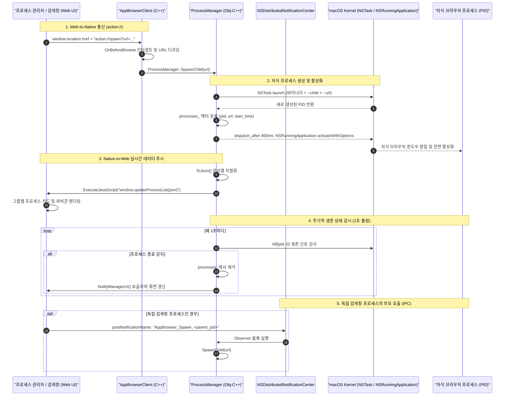
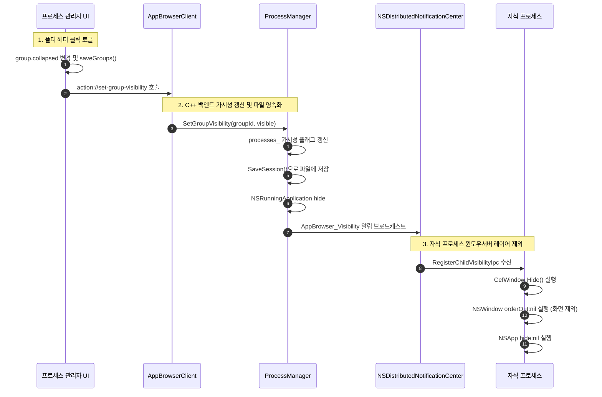
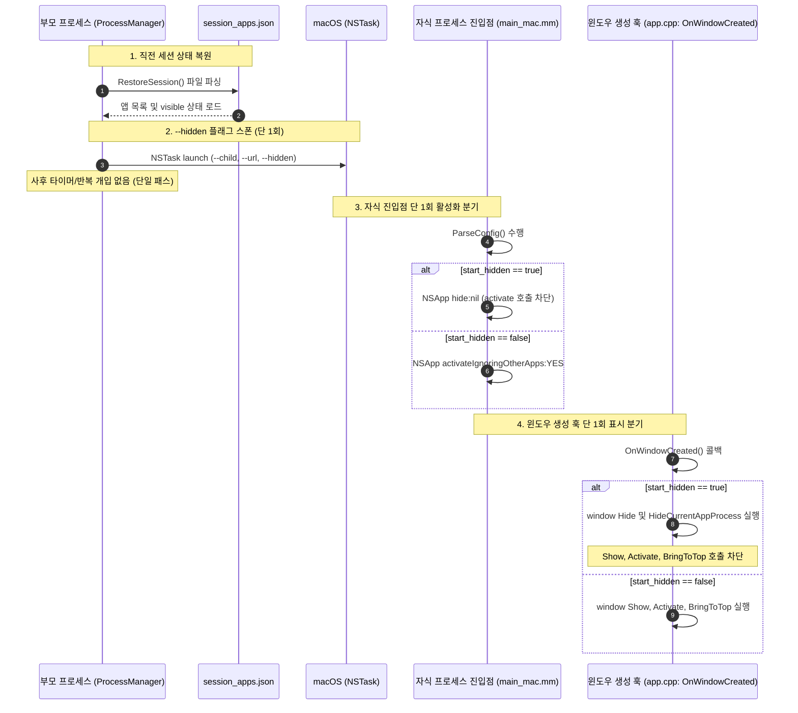

# 프로세스 간 상호작용 및 내부 저장소 아키텍처 가이드

본 문서는 **AppBrowser**의 다중 프로세스 간 상호작용(IPC 및 Web-to-Native 통신)과 그룹 및 프로세스 메타데이터 저장을 위한 내부 저장소의 설계와 구현 방식을 상세히 설명합니다.

---

## 1. 프로세스 간 상호작용 (Inter-Process Interactions)

AppBrowser는 웹 페이지가 단일 프로세스에 갇혀있지 않고, 운영체제(macOS) 레벨에서 완벽히 분리된 프로세스로 동작하도록 설계되었습니다. 이를 위해 4단계의 통신 및 상호작용 레이어가 유기적으로 맞물려 동작합니다.



---

### 1) Web-to-Native 통신 (`action://` Custom URL Protocol)
CEF에 로드된 HTML/JavaScript 환경은 보안상 운영체제의 시스템 콜(`kill`, `fork`, `exec` 등)을 직접 호출할 수 없습니다. AppBrowser는 가상 URL 내비게이션을 인터셉트하는 `action://` 프로토콜을 통신 브리지로 사용합니다.

#### 동작 원리 ([`src/cpp/client.cpp`](../src/cpp/client.cpp)):
1. 프론트엔드 JavaScript가 `window.location.href = 'action://<command>?<params>'` 형태로 주소를 이동합니다.
2. CEF 브라우저가 실제 HTTP 요청을 보내기 전, C++ 핸들러인 `AppBrowserClient::OnBeforeBrowse`가 호출됩니다.
3. 요청 URL이 `action://` 접두사로 시작하는지 검사합니다.
4. 접두사가 일치하면 실제 웹 탐색을 **즉시 중단**(`return true;`)하고, 쿼리 스트링을 파싱하여 해당 명령을 C++ 싱글톤 `ProcessManager`에 위임합니다.

#### 지원 프로토콜 및 매핑:
| Action 프로토콜 | 파라미터 | C++ 수신 메서드 | 동작 설명 |
| :--- | :--- | :--- | :--- |
| `action://spawn` | `url=<URL>` | `ProcessManager::SpawnChild(url)` | 대상 URL을 독립 자식 브라우저로 실행 |
| `action://kill` | `pid=<PID>` | `ProcessManager::TerminateChild(pid)` | 해당 PID의 프로세스를 즉시 종료 |
| `action://focus` | `pid=<PID>` | `ProcessManager::FocusChild(pid)` | 해당 프로세스 윈도우를 macOS 최상단으로 전환 |
| `action://kill-all` | (없음) | `ProcessManager::TerminateAll()` | 등록된 모든 자식 프로세스를 일괄 종료 |
| `action://open-search` | (없음) | `ProcessManager::ShowSearchWindow()` | 검색창 표시 (닫힌 경우 자식 프로세스로 스폰) |
| `action://open-bookmarks` | (없음) | `ProcessManager::ShowBookmarksWindow()` | 즐겨찾기 창을 화면 하단에 표시 |
| `action://close-bookmarks` | (없음) | `ProcessManager::HideBookmarksWindow()` | 즐겨찾기 창을 백그라운드로 숨김 (`Hide`) |
| `action://ready` | (없음) | `ProcessManager::NotifyManagerUI()` | 관리자 UI 로드 완료 시 최신 프로세스 목록 전송 |

---

### 2) 부모 프로세스의 자식 프로세스 제어 (`NSTask` & `NSRunningApplication`)
부모 프로세스는 macOS AppKit API를 사용하여 자식 프로세스의 라이프사이클을 완벽히 통제합니다 ([`src/mm/process_manager.mm`](../src/mm/process_manager.mm)).

- **자식 프로세스 실행 (`SpawnChild`)**:
  ```objc
  NSURL* executableURL = [[NSBundle mainBundle] executableURL];
  NSArray<NSString*>* arguments = @[@"--child", [NSString stringWithFormat:@"--url=%@", urlNs]];
  NSTask* task = [[NSTask alloc] init];
  [task setExecutableURL:executableURL];
  [task setArguments:arguments];
  [task launchAndReturnError:&error];
  pid_t pid = [task processIdentifier];
  ```
  - 동일한 앱 번들 바이너리를 `--child` 플래그와 함께 `NSTask`로 실행합니다.
  - 실행된 태스크 객체는 `g_activeTasks` 배열에 보관되어 부모 종료 시 일괄 정리됩니다.
- **포커스 전환 (`FocusChild`)**:
  ```objc
  NSRunningApplication* app = [NSRunningApplication runningApplicationWithProcessIdentifier:pid];
  if (app) {
    [app activateWithOptions:NSApplicationActivateIgnoringOtherApps];
  }
  ```
  - 사용자가 관리자 창에서 특정 프로세스의 **[↗️ 활성화]** 버튼을 누르면, macOS 윈도우 서버에 포커스 전환을 요청하여 해당 창을 전면으로 가져옵니다.
- **프로세스 강제 종료 (`TerminateChild` / `TerminateAll`)**:
  - `kill(pid, SIGTERM)` 시스템 콜을 전달하여 자식 프로세스를 안전하게 종료하고, 백그라운드 태스크 목록에서 등록을 해제합니다.

---

### 3) Native-to-Web 실시간 데이터 동기화 (`NotifyManagerUI`)
부모 프로세스에서 프로세스 생성, 종료, 또는 상태 변화가 감지되면, C++는 관리자 웹 뷰로 데이터를 실시간 푸시합니다.

1. **JSON 직렬화 (`ProcessManager::ToJson`)**:
   ```json
   {
     "parentPid": 12345,
     "processes": [
       {
         "pid": 12348,
         "url": "https://www.youtube.com",
         "title": "YouTube",
         "startTime": "15:30:12"
       }
     ]
   }
   ```
2. **JavaScript 원격 실행**:
   ```cpp
   std::string json = ToJson();
   std::string script = "if (window.updateProcessList) { window.updateProcessList(" + json + "); }";
   manager_browser_->GetMainFrame()->ExecuteJavaScript(script, frame->GetURL(), 0);
   ```
3. 프론트엔드의 `window.updateProcessList(data)`가 호출되어 화면의 프로세스 카드 목록과 실행 통계 배지가 즉시 갱신됩니다.

---

### 4) 실시간 생존 확인 폴링 (Liveness Check)
사용자가 관리자 창을 거치지 않고 자식 브라우저 창의 빨간색 닫기 버튼(X)을 누르거나 `Cmd+W`로 종료하는 경우, 부모 프로세스는 이를 감지해야 합니다.

- [`src/cpp/app.cpp`](../src/cpp/app.cpp)의 `ScheduleProcessLivenessCheck()`는 1초(1000ms) 주기로 CEF UI 스레드에 타이머 태스크를 예약합니다.
- `ProcessManager::RefreshProcesses()`에서 모든 활성 PID에 대해 `kill(pid, 0)` 신호를 보냅니다.
  - 리눅스/유닉스/macOS에서 `kill(pid, 0)`은 프로세스에 실제 시그널을 전달하지 않고 프로세스의 존재 유무(권한 및 실행 여부)만 확인합니다.
  - 반환값이 `0`이 아니면 이미 OS 레벨에서 종료된 프로세스이므로 벡터에서 제거하고 관리자 UI를 자동 갱신합니다.

---

### 5) 분산 프로세스 간 IPC (`NSDistributedNotificationCenter`)
검색창이 닫힌 후 프로세스 관리자 창의 **[검색창]** 버튼을 누르면, 검색창은 부모 프로세스가 아닌 별도의 독립 자식 프로세스(`--search --parent-pid=<PID>`)로 기동됩니다.
- 독립 프로세스로 뜬 검색창은 부모의 C++ 인스턴스를 직접 호출할 수 없습니다.
- 따라서 macOS 전역 IPC 채널인 `NSDistributedNotificationCenter`를 사용합니다:
  - **송신자 (자식 검색창)**: 사용자가 검색어를 입력하면 `AppBrowser_Spawn_<parent_pid>` 이름의 시스템 알림에 URL 딕셔너리를 담아 브로드캐스트합니다.
  - **수신자 (부모 프로세스)**: `InitIpc()`에서 해당 알림을 리스닝하고 있다가, 수신 즉시 부모 프로세스의 `SpawnChild(url)`를 실행하여 새 브라우저 창을 생성합니다.

---

### 6) 폴더 상태에 따른 자식 프로세스 가시성(Visibility) 제어 및 단일 패스 영속화 아키텍처

프로세스 관리 창에서 사용자가 특정 폴더(그룹)를 접거나 닫으면(`collapsed: true`), 해당 폴더에 속한 모든 자식 웹 브라우저 창은 화면에서 숨겨져야(`Hide`) 합니다. 반대로 접힌 폴더를 다시 클릭하여 펼치면(`collapsed: false`) 숨겨졌던 창들이 원래 작업 위치로 복원되어야 합니다.

더 나아가, **앱 자체를 완전히 종료했다가 다시 실행하더라도 폴더가 닫혀 있었다면 해당 자식 창들은 재시작 직후 화면에 튀어나오지 않고 닫힌 폴더 상태 그대로 백그라운드 숨김 상태를 유지**해야 합니다.

AppBrowser는 이를 사후 타이머나 폴링 없이, 프로세스 생성 라이프사이클의 정확한 훅에서 단 1회의 판정만으로 처리하는 **단일 패스(Single-pass) 결정적 아키텍처**로 구현했습니다.

#### 1. 런타임 가시성 제어 흐름 (Folder Collapse / Expand Flow):


- **액션 큐(`dispatchAction`)**: 여러 폴더를 빠르게 연속해서 여닫더라도 Chromium 내비게이션 취소(Navigation Abort)가 발생하지 않도록 45ms 간격의 순차 FIFO 큐를 통해 백엔드로 유실 없이 전달됩니다.
- **다중 계층 은닉**: CEF 엔진의 `window->Hide()`뿐만 아니라 Cocoa 플랫폼 레벨의 `[[view window] orderOut:nil]` 및 `[NSApp hide:nil]`을 함께 호출하여 macOS WindowServer 렌더링 파이프라인에서 창을 즉각 제외합니다.

#### 2. 앱 재시작 시 단일 패스(Single-Pass) 숨김 복원 아키텍처:
사후에 타이머(`dispatch_after`)를 돌려 뜬 창을 닫으려고 시도하면 화면 깜빡임(Flicker)이 발생하고 프로세스 로딩 속도에 따라 타이밍 이슈가 생깁니다. AppBrowser는 기동 시점부터 창이 아예 뜨지 않도록 **프로세스 진입점 및 윈도우 생성 훅에서 단 1회의 조건 분기**로 처리합니다.



#### 3. 핵심 구현 코드 레퍼런스:

1. **부모 프로세스 스폰 ([`src/mm/process_manager.mm`](../src/mm/process_manager.mm))**:
   - `SpawnChild(url, visible)`에서 `visible == false`인 경우 커맨드라인 인자에 `"--hidden"`을 추가하여 자식 프로세스가 자신이 숨김 기동 대상임을 인지하게 합니다. 부모는 사후 타이머를 전혀 돌리지 않습니다.
2. **자식 프로세스 진입점 ([`src/mm/main_mac.mm`](../src/mm/main_mac.mm))**:
   - `ParseConfig(argc, argv)`를 가장 먼저 수행하여, `config.start_hidden`이 참인 경우 `[NSApp activateIgnoringOtherApps:YES]` 호출을 원천 차단하고 `[NSApp hide:nil]`을 즉각 실행합니다.
3. **CEF 윈도우 생성 델리게이트 ([`src/cpp/app.cpp`](../src/cpp/app.cpp))**:
   - `AppBrowserWindowDelegate::OnWindowCreated`에서:
     ```cpp
     if (!config_.start_hidden) {
       window->Show();
       window->Activate();
       window->BringToTop();
       ActivateApplication();
     } else {
       window->Hide();
       HideCurrentAppProcess(window); // orderOut:nil 및 NSApp hide:nil 즉시 실행
     }
     ```
   - 윈도우가 생성되는 최초 순간에 `Show()` 및 활성화 로직을 전혀 실행하지 않으므로 화면에 단 1프레임의 노출이나 깜빡임도 발생하지 않습니다.
4. **프로세스 관리자 UI 지속적 검증 ([`resources/web/manager/manager.js`](../resources/web/manager/manager.js))**:
   - `window.updateProcessList` 수신 시 닫힌 폴더(`group.collapsed == true`) 내에 속한 프로세스의 가시성(`proc.visible`)을 매 주기 재확인하여, 예기치 않은 상태 불일치가 존재할 경우 즉시 `action://set-child-visibility?pid=...&visible=0`을 디스패치합니다.

---

## 2. 그룹 및 메타데이터 내부 저장소 (Internal Storage Architecture)

프로세스 관리 창에서 사용자가 정의한 **그룹(가상 폴더)** 정보와 **프로세스별 이름**, 그리고 **즐겨찾기 목록**은 앱을 종료하고 다시 켜도 유지되어야 합니다.

AppBrowser는 CEF의 영속성 저장소 아키텍처와 HTML5 Web Storage (`localStorage`)를 결합하여 **로컬 LevelDB 기반의 고성능 내부 저장소**를 구축했습니다.

---

### 1) 물리적 저장소 위치 및 격리 구조
- **정확한 물리적 경로**: `~/Library/Application Support/AppBrowser/Parent/Default/Local Storage/leveldb/`
- **구조적 특징 및 Chromium 프로필 계층**:
  - `src/mm/main_mac.mm`에서 부모 프로세스의 `cache_path` 및 `root_cache_path`를 `~/Library/Application Support/AppBrowser/Parent`로 지정했습니다.
  - Chromium/CEF는 지정된 루트 캐시 디렉터리 내에 기본 사용자 프로필 디렉터리인 **`Default/`** 를 자동으로 생성합니다.
  - 브라우저의 모든 HTML5 Web Storage(`localStorage`)는 바로 이 프로필 하위의 **`Default/Local Storage/leveldb/`** 에 Google LevelDB 바이너리 포맷으로 안전하게 영구 보관됩니다.

#### 💡 왜 `.db`나 `.sqlite` 단일 파일이 없고 `.log` 파일이 보이나요?
Chromium은 로컬 스토리지 엔진으로 관계형 DB(SQLite) 대신 구글이 개발한 초고속 Key-Value 엔진인 **LevelDB(LSM-Tree 구조)** 를 사용합니다. LevelDB는 단일 파일 DB가 아니며, 디렉터리 전체가 하나의 데이터베이스를 이룹니다:
- **`00000x.log` (Write-Ahead Log, WAL)**: **실제 데이터가 저장되는 핵심 파일입니다.** 사용자가 `localStorage.setItem`을 실행하면 이 로그 파일에 직렬화된 데이터가 즉시 바이너리로 추가(Append) 기록됩니다.
- **`MANIFEST-000001`**: LevelDB의 데이터 버전 및 레벨(Level) 메타데이터를 추적하는 파일입니다.
- **`CURRENT`**: 현재 활성화된 최신 매니페스트 파일명을 가리키는 텍스트 포인터입니다.
- **`LOCK`**: 여러 프로세스가 동시에 DB 디렉터리를 수정하지 못하도록 차단하는 OS 파일 락입니다.
- **`LOG` / `LOG.old`**: LevelDB 내부 압축(Compaction) 및 I/O 동작 진단 로그입니다.

실제로 `000003.log` 내부를 열어보면 사용자가 저장한 JSON(`appbrowser_groups_v1`, `appbrowser_bookmarks_v1` 등)이 그대로 기록되어 있음을 확인할 수 있습니다:
```bash
# 터미널에서 실제 저장된 JSON 데이터 확인
strings ~/Library/Application\ Support/AppBrowser/Parent/Default/Local\ Storage/leveldb/000003.log | grep -E "appbrowser|default"
```
- **자식 브라우저 프로세스(`Child_<DomainHash>`)**:
  - 기존의 임시 PID 방식 대신, URL에서 경로를 제외한 도메인(예: `google.com`)을 추출한 후 **64-bit FNV-1a 해시 알고리즘을 통해 계산된 고유 자연수(`uint64_t`)**를 디렉터리명으로 사용합니다 (`Child_<DomainHash>`).
  - 이를 통해 동일 도메인의 웹 앱(예: Google 검색, Google 문서도구 등)은 재실행되더라도 동일한 세션/쿠키/캐시를 영속적으로 공유하며, 다른 도메인과는 완벽히 격리됩니다.

---

### 2) 저장소 키(Key) 및 데이터 스키마(Schema)

프로세스 관리자는 2개의 핵심 키를 사용하여 데이터를 관리합니다 ([`resources/web/manager/manager.js`](../resources/web/manager/manager.js)):

```text
localStorage
├── "appbrowser_groups_v1"        : 폴더(그룹) 목록 JSON
├── "appbrowser_process_meta_v1"  : 프로세스별 이름 및 소속 그룹 매핑 JSON
└── "appbrowser_bookmarks_v1"     : 즐겨찾기 아이템 목록 JSON (즐겨찾기 창 전용)
```

#### ① 그룹 목록 스키마 (`appbrowser_groups_v1`):
```json
[
  {
    "id": "default",
    "name": "기본 그룹",
    "collapsed": false
  },
  {
    "id": "group_1725589200000",
    "name": "개발 및 업무",
    "collapsed": false
  },
  {
    "id": "group_1725589210000",
    "name": "미디어 & 엔터테인먼트",
    "collapsed": true
  }
]
```
- `id`: 고유 식별자 (`default`는 시스템 불변 기본 그룹, 사용자가 추가한 그룹은 `group_<timestamp>`).
- `name`: 사용자가 지정한 폴더 이름.
- `collapsed`: 폴더 접힘/열림 상태 (UI 렌더링 시 보존).

#### ② 프로세스 메타데이터 스키마 (`appbrowser_process_meta_v1`):
프로세스는 PID가 매 실행 시마다 바뀌므로, PID 문자열을 키로 하여 사용자가 부여한 커스텀 이름과 소속 그룹 ID를 기록합니다.
```json
{
  "38412": {
    "name": "깃허브 저장소",
    "groupId": "group_1725589200000"
  },
  "38450": {
    "name": "유튜브 음악",
    "groupId": "group_1725589210000"
  }
}
```
- `name`: 사용자가 더블 클릭 또는 수정 모달을 통해 입력한 사용자 정의 프로세스명.
- `groupId`: 해당 프로세스가 배치된 그룹 ID.

---

### 3) 데이터 무결성 및 비즈니스 로직 보장 (Business Logic)

내부 저장소 로직에는 사용자의 실수나 예외 상황을 방지하기 위한 강력한 무결성 규칙이 구현되어 있습니다:

#### 1. 기본 그룹(`default`) 불변성 보장:
- `loadGroups()` 실행 시 저장소에 `default` 그룹이 없거나 데이터가 손상된 경우, 자동으로 `[{ id: 'default', name: '기본 그룹', collapsed: false }]`를 생성하여 복구합니다.
- `default` 그룹은 헤더의 삭제 버튼이 렌더링되지 않으며 삭제가 원천 차단됩니다.

#### 2. 그룹 삭제 시 프로세스 자동 재배치 (Cascading Fallback):
- 사용자가 특정 커스텀 그룹(예: `group_1725589200000`)을 삭제하면:
  ```javascript
  // 1. 해당 그룹에 속해 있던 모든 프로세스를 기본 그룹('default')으로 재배정
  Object.keys(processMeta).forEach(pid => {
    if (processMeta[pid].groupId === targetGroupId) {
      processMeta[pid].groupId = 'default';
    }
  });
  saveProcessMeta(processMeta);

  // 2. 그룹 목록에서 제거
  groups = groups.filter(g => g.id !== targetGroupId);
  saveGroups(groups);
  ```
- 실행 중이던 창이 함께 꺼지거나 고아가 되지 않고, 안전하게 `기본 그룹`으로 자동 이동합니다.

#### 3. 그룹 내 프로세스명 유일성 검증 (`isNameTakenInGroup`):
사용자 요구사항에 따라 **"같은 그룹 내에서는 프로세스명이 중복될 수 없으나, 서로 다른 그룹에 위치한 프로세스는 이름이 동일해도 된다"** 는 규칙이 엄격히 적용됩니다.
```javascript
function isNameTakenInGroup(name, groupId, excludePid = null) {
  const targetName = (name || '').trim().toLowerCase();
  for (const proc of currentProcesses) {
    if (excludePid && proc.pid === excludePid) continue;
    const meta = processMeta[String(proc.pid)] || {};
    const procGroupId = meta.groupId || 'default';

    if (procGroupId === groupId) {
      const procName = (meta.name || generateFriendlyName(proc)).trim().toLowerCase();
      if (procName === targetName) {
        return true; // 동일 그룹 내 중복 발견
      }
    }
  }
  return false;
}
```
- 프로세스명을 변경할 때뿐만 아니라, **드롭다운을 통해 프로세스를 다른 그룹으로 이동할 때**에도 대상 그룹에 이미 동일한 이름의 프로세스가 존재하는지 검증하여 중복 충돌을 원천 차단합니다.

#### 4. 지능형 초기 이름 자동 생성 (`generateFriendlyName`):
사용자가 아직 이름을 지정하지 않은 경우, 단순 URL 주소 대신 사람이 읽기 편한 친절한 기본 이름을 즉시 추론하여 제공합니다:
- Google 검색 결과 페이지: `Google: <검색어>` (쿼리 파라미터 `q` 자동 디코딩)
- GitHub 페이지: `GitHub`
- YouTube 페이지: `YouTube`
- Naver 페이지: `Naver`
- 기타 사이트: 웹페이지 `<title>` 또는 호스트 도메인명
